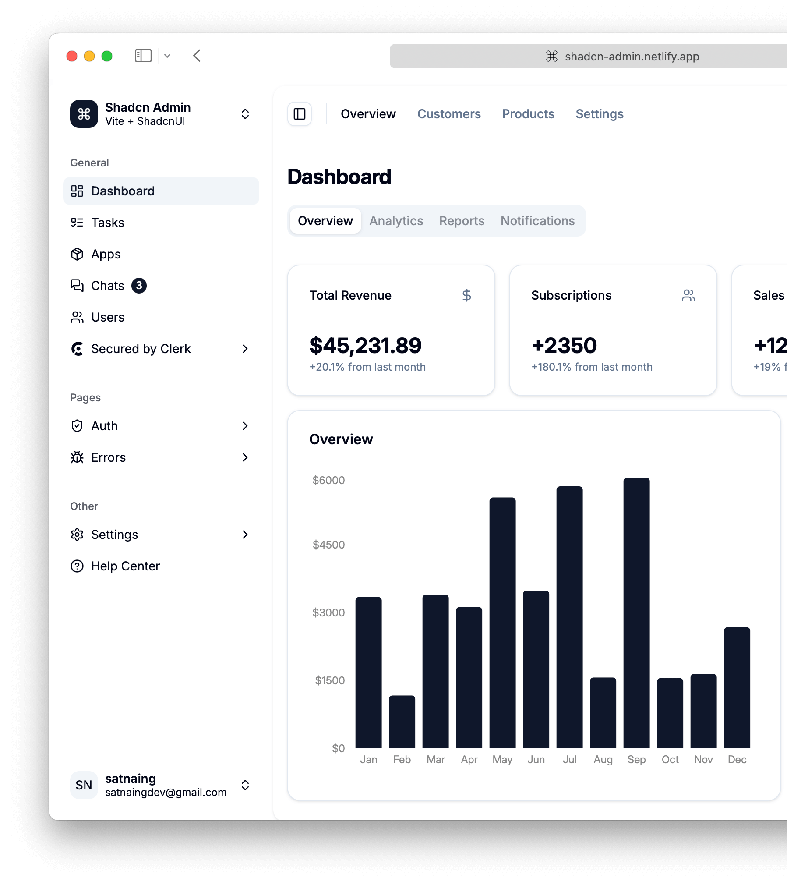
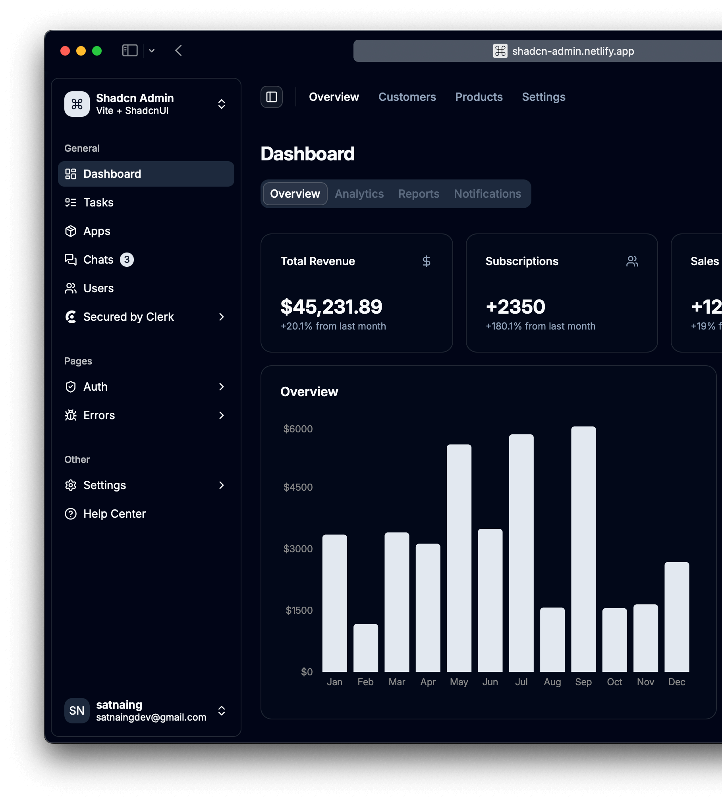

# Panel CRM

Sistema modular de administración, control de acceso y gestión operativa para un panel full stack basado en roles y permisos.

> El objetivo principal del proyecto es centralizar la administración de usuarios, roles, módulos y permisos para que cada usuario acceda solo a lo que necesita dentro del sistema.

## 📸 Capturas del sistema





## 🎯 Objetivo del proyecto

Panel CRM es un panel de administración orientado a:

- gestionar usuarios del sistema,
- crear y asignar roles,
- definir permisos por módulo,
- controlar acceso a vistas y funcionalidades,
- mantener una navegación adaptable según los permisos,
- centralizar la configuración técnica del sistema.

Es un proyecto pensado como base sólida para aplicaciones empresariales o internas con múltiples módulos, donde el control de acceso debe ser claro, seguro y fácil de mantener.

## 🧩 ¿Qué hace esta aplicación?

Este proyecto incluye un panel full stack con módulos y permisos dinámicos. Entre sus principales funciones están:

- Administración de usuarios
    - crear usuarios,
    - editar información,
    - activar o suspender cuentas,
    - invitar usuarios por correo,
    - asignar roles y permisos.

- Administración de roles
    - crear roles,
    - editar roles,
    - quitar o asignar permisos,
    - evitar la eliminación de roles críticos como Super Admin.

- Control de permisos por módulo
    - Inicio,
    - Usuarios,
    - Roles,
    - Navegación,
    - Centro técnico.

- Navegación y acceso
    - menú configurable según el contexto del usuario,
    - restricción por permisos declarados en configuración.

- Centro técnico
    - configuración general del sistema,
    - ajustes para comportamiento del chat y otros parámetros técnicos.

- Chat interno
    - conversaciones directas,
    - grupos,
    - mensajes con archivos,
    - edición y eliminación de mensajes,
    - integración con la lógica del sistema.

## 🛠️ Tecnologías que usamos

### Backend

- PHP 8.2
- Laravel 12
- Laravel Fortify
- Spatie Laravel Permission
- Livewire

### Frontend

- Vite
- Tailwind CSS
- JavaScript vanilla
- Livewire para interactividad sin construir una API separada

### Herramientas y librerías

- Composer
- NPM
- FilePond
- CropperJS
- Blobatar
- Axios

### Base de datos

- Compatible con bases relacionales que maneja Laravel, como:
    - MySQL
    - PostgreSQL
    - SQLite

## 📁 Estructura general del proyecto

- app/: lógica del negocio, modelos, servicios, Livewire y controladores.
- config/: configuración del sistema, módulos y permisos.
- database/: migraciones y factories.
- resources/: vistas, CSS y assets frontend.
- routes/: rutas web principales.
- public/: assets públicos y entrada del sitio.
- tests/: pruebas automatizadas.

## 🚀 Instalación y configuración

### 1) Clona el repositorio

```bash
git clone https://github.com/EnriqueMagana/Panel_CRM.git
cd Panel_CRM
```

### 2) Instala dependencias de PHP

```bash
composer install
```

### 3) Configura las variables de entorno

```bash
cp .env.example .env
```

Luego edita el archivo `.env` y configura tu base de datos, por ejemplo:

```env
DB_CONNECTION=mysql
DB_HOST=127.0.0.1
DB_PORT=3306
DB_DATABASE=snippetdesk
DB_USERNAME=root
DB_PASSWORD=
```

### 4) Genera la clave de la aplicación

```bash
php artisan key:generate
```

### 5) Ejecuta migraciones

```bash
php artisan migrate
```

### 6) Instala dependencias del frontend

```bash
npm install
```

### 7) Compila los assets

```bash
npm run build
```

### 8) Inicia la aplicación

```bash
php artisan serve
```

Luego abre esta URL en tu navegador:

```text
http://localhost:8000
```

## ⚡ Método rápido

Si quieres un arranque más directo, este proyecto ya incluye un script de configuración:

```bash
composer run setup
```

Este comando intenta:

- instalar dependencias PHP,
- crear el archivo `.env` si no existe,
- generar la llave,
- ejecutar migraciones,
- instalar dependencias JS,
- compilar assets.

## 👤 Cómo funciona el sistema de roles y permisos

El proyecto usa una estructura modular para definir permisos por sección.

En `config/access.php` se configuran los módulos y sus permisos disponibles, por ejemplo:

- `dashboard`: ver
- `users`: ver, crear, editar, eliminar, asignar roles
- `roles`: ver, crear, editar, eliminar
- `navigation`: ver, administrar
- `technical_center`: ver, administrar

Esto permite que cada usuario tenga un nivel de acceso diferente según su rol. Por ejemplo:

- `Super Admin`: acceso total.
- `Administrador`: puede manejar usuarios y roles.
- `Usuario normal`: solo accede a módulos permitidos.

## 🧠 ¿Cuál es el flujo principal?

1. Un usuario inicia sesión.
2. El sistema valida qué módulos y permisos tiene disponibles.
3. La interfaz muestra solo las opciones que el usuario puede usar.
4. Cada acción del backend revisa permisos antes de ejecutarse.
5. La configuración queda centralizada y es fácil escalar al agregar nuevos módulos.

## ✅ Funcionalidades principales

- Panel administrativo completo
- Gestión de usuarios y roles
- Control granular de permisos
- Módulos configurables
- Acceso restringido por roles
- Chat interno con conversaciones grupales y directas
- Invitaciones por correo
- Ajustes de configuración técnica
- Interfaz moderna y responsive

## 🧪 Ejecutar pruebas

```bash
php artisan test
```

## 📌 Recomendaciones

- Usa roles claros y específicos para cada tipo de usuario.
- Define permisos por módulo en lugar de dar acceso global.
- Mantén la configuración de `config/access.php` como fuente de verdad para permisos.
- Revisa regularmente quién puede crear, editar o eliminar información crítica.

## 🏁 Resumen

Panel CRM es un panel full stack de roles y permisos pensado para aplicaciones con módulos y administración centralizada. Su objetivo no es solo mostrar usuarios, sino crear una base segura, organizada y escalable para gestionar accesos y funciones dentro del sistema.
